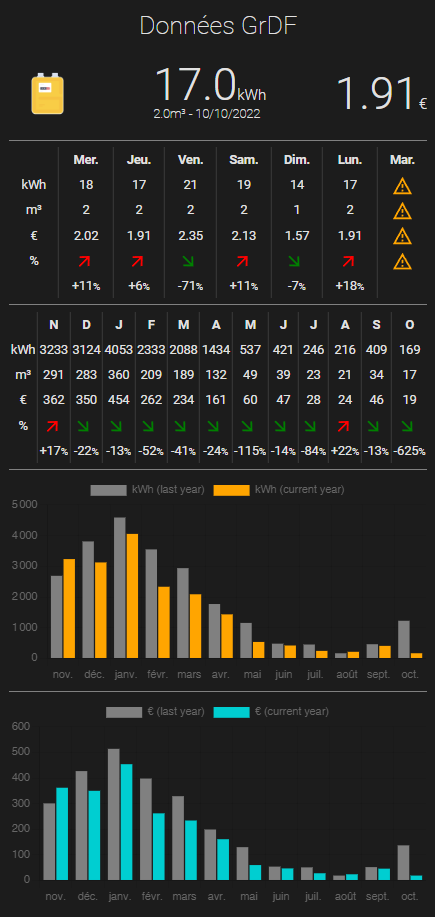
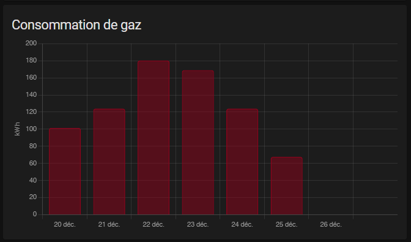

# Home Assistant GrDF Gazpar

GrDF Gazpar integration permits to integrate in Home Assistant all your gas consumption data.

From version 1.2.0, it is compatible with [Lovelace Garpar Card](https://github.com/ssenart/lovelace-gazpar-card).



GrDF Gazpar custom component is using [PyGazpar](https://github.com/ssenart/PyGazpar) library to retrieve GrDF data.

## Installation

### Method 1 : HACS (recommended)

Follow the steps described below to add GrDF Gazpar integration with [HACS](https://hacs.xyz/):

1. From [HACS](https://hacs.xyz/) (Home Assistant Community Store), open the upper left menu and select `Custom repositories` option to add the new repo.

2. Add the address <https://github.com/ssenart/home-assistant-gazpar> with the category `Integration`, and click `ADD`. The new corresponding repo appears in the repo list.

3. Select this repo (this integration description is displayed in a window) and click on `INSTALL THIS REPOSITORY` button on the lower right of this window.

4. Keep the last version and click the button `INSTALL` on the lower right.

5. Do click on `RELOAD` button for completion! The integration is now ready. It remains the configuration.

### Method 2 : Manual

Copy the gazpar directory in HA config/custom_components/gazpar directory.

## Configuration

Add to your Home Assistant configuration.yaml:

```yaml
sensor:
- platform: 'gazpar'
  username: '***'
  password: '***'
  pce_identifier: 'xxxxxxxxx'
  tmpdir: '/tmp'
  scan_interval: '01:00:00'
```

Ensure that tmpdir already exists before starting HA. It is used to store the downloaded files from GrDF.

Restart your HA application. In HA development panel, you should see the new Gazpar entity 'sensor.gazpar' with its corresponding attributes:

- sensor.gazpar:
```yaml
attribution: Data provided by GrDF
username: titi.toto@tata.fr
pce: 123456789
unit_of_measurement: kWh
friendly_name: Gazpar
icon: mdi:fire
device_class: energy
state_class: total_increasing
errorMessages:
hourly: 
daily: 
- time_period: 07/10/2022
  start_index_m3: 15714
  end_index_m3: 15716
  volume_m3: 2
  energy_kwh: 21
  converter_factor_kwh/m3: 11.27
  type: Mesuré
  timestamp: '2022-10-09T20:59:12.356210'
- time_period: 06/10/2022
  start_index_m3: 15713
  end_index_m3: 15714
  volume_m3: 2
  energy_kwh: 17
  converter_factor_kwh/m3: 11.27
  type: Mesuré
  timestamp: '2022-10-09T20:59:12.356210'
...

weekly: 
- time_period: Du 03/10/2022 au 09/10/2022
  volume_m3: 9
  energy_kwh: 87
  timestamp: '2022-10-09T20:59:13.391911'
- time_period: Du 26/09/2022 au 02/10/2022
  volume_m3: 11
  energy_kwh: 132
  timestamp: '2022-10-09T20:59:13.391911'
...

monthly: 
- time_period: 'Octobre 2022 '
  volume_m3: 12
  energy_kwh: 119
  timestamp: '2022-10-09T20:59:14.447149'
- time_period: 'Septembre 2022 '
  volume_m3: 34
  energy_kwh: 409
  timestamp: '2022-10-09T20:59:14.447149'
...

yearly: 
- time_period: '2022'
  energy_kwh: 11958
  volume_m3: 1078
- time_period: '2021'
  energy_kwh: 23148
  volume_m3: 2099
- time_period: '2020'
  energy_kwh: 21160
  volume_m3: 1904

...
```

## Home Assistant Energy module integration

You probably want to integrate GrDF data into the Home Assistant Energy module.



For that, I'm using the 2 steps configuration method:

- Step 1 : Create a dedicated meter sensor using template:

```yaml
template:
  - sensor:
    - name: gas_volume
      unit_of_measurement: 'm³'
      state: >
        {{ state_attr('sensor.gazpar', 'daily')[0]['end_index_m3'] | float(0) }}
      icon: mdi:fire
      device_class: gas
      state_class: total_increasing
    - name: gas_energy
      unit_of_measurement: 'kWh'      
      state: >   
        {{ states('sensor.gazpar') | float(0) }}
      icon: mdi:fire
      device_class: energy
      state_class: total_increasing
```

- Step 2 : Setup utility_meter to get consumptions by period:

```yaml
utility_meter:
  total_gas_volume:
    source: sensor.gas_volume
  daily_gas_volume:
    source: sensor.gas_volume    
    cycle: daily
  weekly_gas_volume:
    source: sensor.gas_volume    
    cycle: weekly 
  monthly_gas_volume:
    source: sensor.gas_volume    
    cycle: monthly
  yearly_gas_volume:
    source: sensor.gas_volume    
    cycle: yearly
  
  total_gas_energy:
    source: sensor.gas_energy
  daily_gas_energy:
    source: sensor.gas_energy    
    cycle: daily
  weekly_gas_energy:
    source: sensor.gas_energy    
    cycle: weekly 
  monthly_gas_energy:
    source: sensor.gas_energy    
    cycle: monthly
  yearly_gas_energy:
    source: sensor.gas_energy    
    cycle: yearly  
```

Then, in Home Assistant energy configuration panel,add the sensor 'sensor.total_gas_energy' in gas consumption section.
Adding 'sensor.gas_energy' should be the same.

Step 2 is optional. It only permits to monitor by yourself the consumption by period, without relying on the HA energy module.

I would expect that adding volume sensor being available as well, but it is not for an unknown reason. I did not dig further since I prefer to monitor kWh rather than volume.
