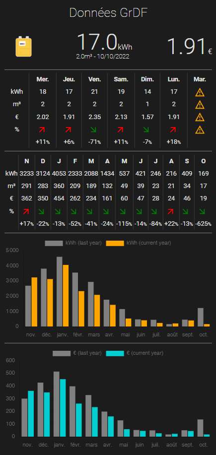
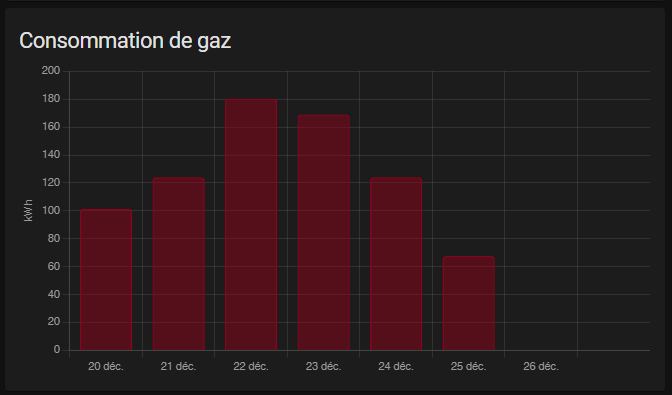

# Home Assistant GrDF Gazpar

GrDF Gazpar integration permits to integrate in Home Assistant all your gas consumption data.

From version 1.2.0, it is compatible with [Lovelace Gazpar Card](https://github.com/ssenart/lovelace-gazpar-card).



GrDF Gazpar custom component is using [PyGazpar](https://github.com/ssenart/PyGazpar) library to retrieve GrDF data.

## Alternative integration using MQTT

home-assistant-gazpar integration is using Home Assistant API and may be broken from a HA release to another.

A good alternative is using MQTT integration with the [Gazpar2MQTT](https://github.com/ssenart/gazpar2mqtt) application.

[Gazpar2MQTT](https://github.com/ssenart/gazpar2mqtt) has been developed recently for a better loose coupling with HA.

[Gazpar2MQTT](https://github.com/ssenart/gazpar2mqtt) is also compatible with [Lovelace Gazpar Card](https://github.com/ssenart/lovelace-gazpar-card).

## Installation

### Method 1 : HACS (recommended)

Follow the steps described below to add GrDF Gazpar integration with [HACS](https://hacs.xyz/):

1. From [HACS](https://hacs.xyz/) (Home Assistant Community Store), open the upper left menu and select `Custom repositories` option to add the new repo.

2. Add the address <https://github.com/ssenart/home-assistant-gazpar> with the category `Integration`, and click `ADD`. The new corresponding repo appears in the repo list.

3. Select this repo (this integration description is displayed in a window) and click on `INSTALL THIS REPOSITORY` button on the lower right of this window.

4. Keep the last version and click the button `INSTALL` on the lower right.

5. Do click on `RELOAD` button for completion! The integration is now ready. It remains the configuration.

### Method 2 : Manual

Copy the gazpar directory in HA config/custom_components/gazpar directory.

## Configuration

### Set up from the Home Assistant UI

Go to Settings > Devices & services > Add integration, search for "GrDF Gazpar", then enter your GrDF username, your password, the identifier of your gas meter (PCE) and a name for the sensor. The account is checked against GrDF before it is saved.

The options (update interval and number of days downloaded) can be changed later from the integration's Configure button. The sensor is named after the name you chose, so `sensor.gazpar` for the default name.

### YAML configuration (still supported)

Existing YAML configurations keep working without any change. When Home Assistant starts, the YAML configuration is imported into the UI, and the sensor is then managed by that entry. While the YAML configuration is there, it updates the entry of the same meter, so its values take precedence over the options set in the UI. You can remove the YAML configuration once you are happy with the UI setup; the entry stays.

Add to your Home Assistant configuration.yaml:

```yaml
sensor:
- platform: 'gazpar'
  name: 'gazpar'
  username: '***'
  password: '***'
  pce_identifier: 'xxxxxxxxx'
  tmpdir: '/tmp'
  scan_interval: '08:00:00'
  lastNDays: 365
```

Options:

- `name`: the sensor name (only available from version 1.3.5-alpha.1). Default: `gazpar`.
- `username` and `password`: your GrDF account credentials.
- `pce_identifier`: the identifier of your meter (PCE).
- `tmpdir`: required. The folder where the Excel files from GrDF are stored, used only with `datasource: 'excel'`.
- `datasource`: `json` (default), `excel`, or `test` (sample data, no connection to GrDF).
- `scan_interval`: how often GrDF is queried. Default: `04:00:00`.
- `lastNDays`: the number of days of data to download from GrDF (only available from version 1.3.9). Default: 1095 (3 years).

If you have the error: 
```
An error occurred while loading data. Status code: 500 - {"code":500,"message":"Internal Server Error"}
```
...it is likely you try to get more data than available. Please reduce the lastNDays parameter accordingly (see issue [#62](https://github.com/ssenart/home-assistant-gazpar/issues/62)).

Do not use special characters in your password.

Ensure that tmpdir already exists before starting HA.

If using multiple accounts, you can specify them with the following syntax:

```yaml
sensor:
- platform: 'gazpar'
  name: 'mygazpar'
  username: '***'
  password: '***'
  pce_identifier: 'xxxxxxxxx'
  tmpdir: '/tmp'
  scan_interval: '08:00:00'

- platform: 'gazpar'
  name: 'othergazpar'
  username: '***'
  password: '***'
  pce_identifier: 'xxxxxxxxx'
  tmpdir: '/tmp'
  scan_interval: '08:00:00'  
```

Restart your HA application. In HA development panel, you should see the new Gazpar entity 'sensor.gazpar' with its corresponding attributes. Its state is the cumulative energy in kWh, computed from the index readings. If the readings do not allow a state to be computed, for example because of a gap in the index data, the sensor keeps its last known state and logs a warning.

The attributes below keep the most recent readings: at most 14 daily, 20 weekly, 24 monthly, 5 yearly and 1 hourly.

- sensor.gazpar:
```yaml
attribution: Data provided by GrDF
pce: 123456789
unit_of_measurement: kWh
friendly_name: gazpar
icon: mdi:fire
device_class: energy
state_class: total_increasing
errorMessages:
hourly: 
daily: 
- time_period: 07/10/2022
  start_index_m3: 15714
  end_index_m3: 15716
  volume_m3: 2
  energy_kwh: 21
  converter_factor_kwh/m3: 11.27
  type: Mesuré
  timestamp: '2022-10-09T20:59:12.356210'
- time_period: 06/10/2022
  start_index_m3: 15713
  end_index_m3: 15714
  volume_m3: 2
  energy_kwh: 17
  converter_factor_kwh/m3: 11.27
  type: Mesuré
  timestamp: '2022-10-09T20:59:12.356210'
...

weekly: 
- time_period: Du 03/10/2022 au 09/10/2022
  volume_m3: 9
  energy_kwh: 87
  timestamp: '2022-10-09T20:59:13.391911'
- time_period: Du 26/09/2022 au 02/10/2022
  volume_m3: 11
  energy_kwh: 132
  timestamp: '2022-10-09T20:59:13.391911'
...

monthly: 
- time_period: 'Octobre 2022 '
  volume_m3: 12
  energy_kwh: 119
  timestamp: '2022-10-09T20:59:14.447149'
- time_period: 'Septembre 2022 '
  volume_m3: 34
  energy_kwh: 409
  timestamp: '2022-10-09T20:59:14.447149'
...

yearly: 
- time_period: '2022'
  energy_kwh: 11958
  volume_m3: 1078
- time_period: '2021'
  energy_kwh: 23148
  volume_m3: 2099
- time_period: '2020'
  energy_kwh: 21160
  volume_m3: 1904

...
```

## Home Assistant Energy module integration

### Gazpar2HAWS

A new application [Gazpar2HAWS](https://github.com/ssenart/gazpar2haws) has been developed to feed the Home Assistant Energy dashboard.

It is able to rebuild the full data history and keep it updated.

The dates are now in sync with Home Assistant.

### Legacy method

You probably want to integrate GrDF data into the Home Assistant Energy module.



In Home Assistant energy configuration panel, you can set directly the sensor 'sensor.gazpar' in the gas consumption section.

I prefer using an alias for all my sensors so I keep control on the sensor naming. For that, I define a template and use the template sensor.gas_energy to configure the dashboard.

For those who prefer to use the volume data instead of the energy (kWh) data, the template sensor.gas_volume can also be used. Both sensors are defined under the same `template:` key:

```yaml
template:
  - sensor:
      - name: gas_energy
        unit_of_measurement: 'kWh'
        state: "{{ states('sensor.gazpar') }}"
        icon: mdi:fire
        device_class: energy
        state_class: total_increasing
      - name: gas_volume
        unit_of_measurement: 'm³'
        state: "{{ state_attr('sensor.gazpar', 'daily')[0]['start_index_m3'] + state_attr('sensor.gazpar', 'daily')[0]['volume_m3'] }}"
        icon: mdi:fire
        device_class: gas
        state_class: total_increasing
```
